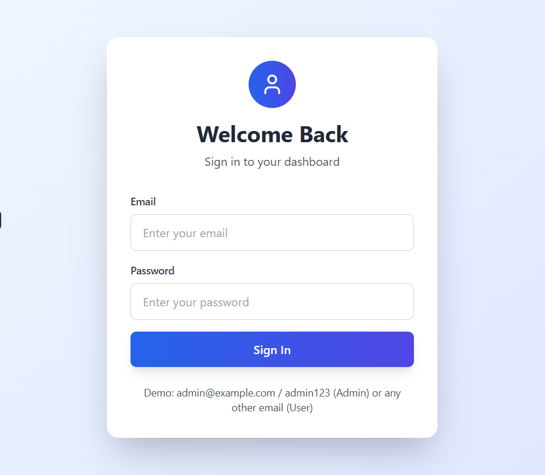
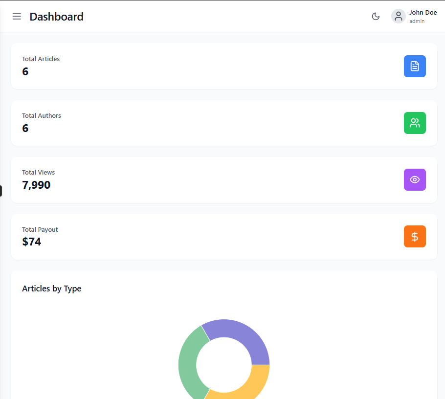
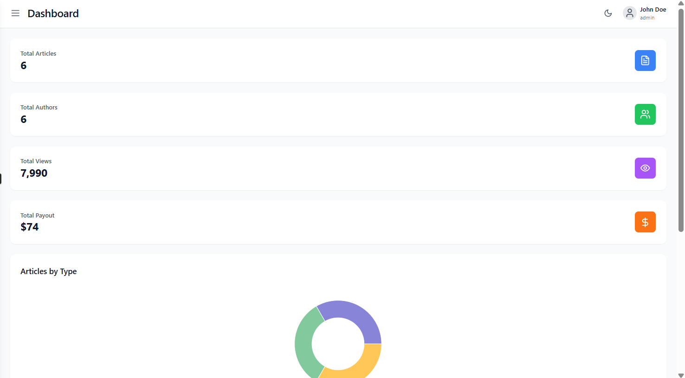
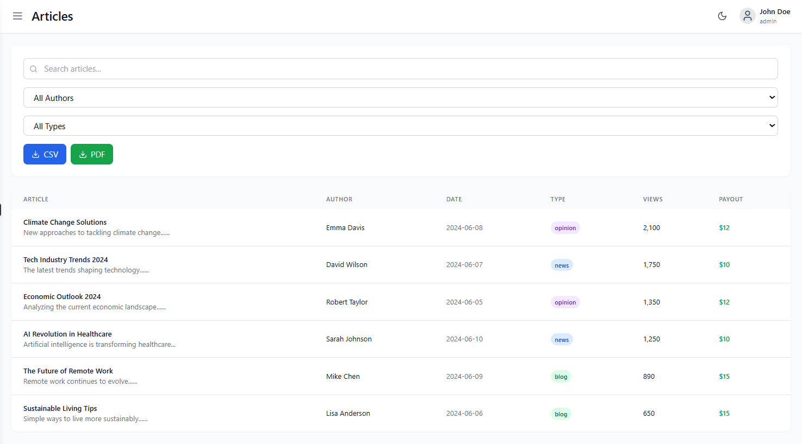
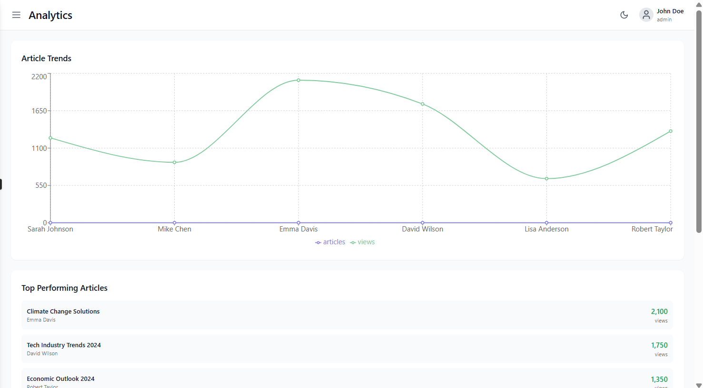
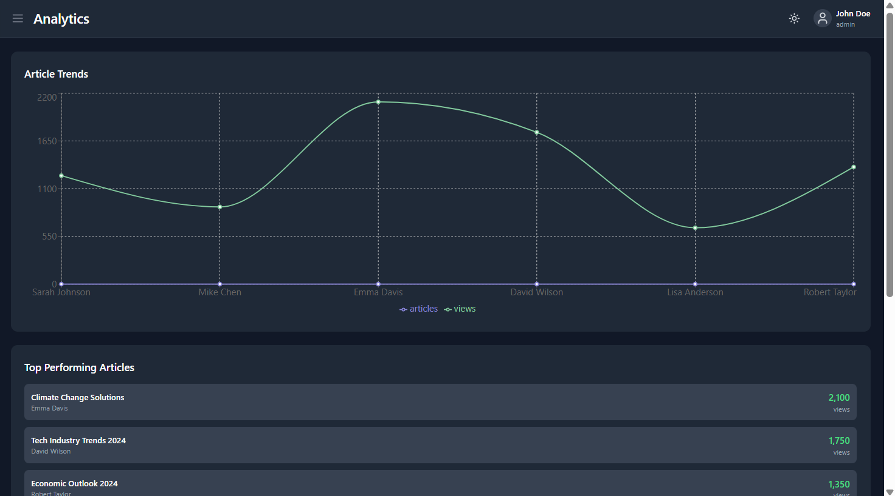
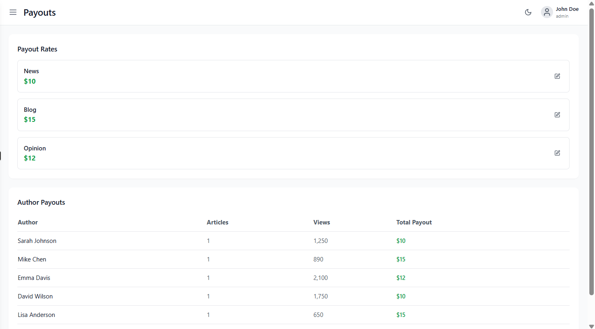
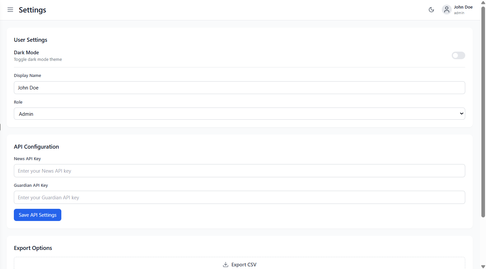

# 📰 News-Dashboard

A modern, responsive dashboard for managing news content, filtering articles, calculating payouts for authors, and exporting reports. Built with Next.js, Tailwind CSS, and React Context API.

---


<!-- 🔧 To change text size, edit `font-size` in the <div> tags (e.g., 30px) -->
<!-- 🧩 To adjust spacing between images, modify `margin-right` in  style -->

<div align="center">



**<div style="font-size:30px; margin-top: 5px;">Login Page</div>**

---




**<div style="font-size:30px; margin-top: 5px;">Dashboard</div>**

---



**<div style="font-size:30px; margin-top: 5px;">Articles</div>**

---




**<div style="font-size:30px; margin-top: 5px;">Analytics</div>**

---



**<div style="font-size:30px; margin-top: 5px;">Payout</div>**

---



**<div style="font-size:30px; margin-top: 5px;">Settings</div>**

</div>


## 📝 Features

- 🔐 **Role-based Access**: Admin-only payout panel with export capabilities  
- 🧾 **News Filters**: Search by author, date, and type  
- 📊 **Analytics**: Article counts and payout data per author  
- 💰 **Payout Calculator**: Admin can set payout rate; real-time calculation  
- 📤 **Export Tools**: CSV, PDF export with jsPDF and PapaParse  
- 🌐 **Google Sheets Integration**: Ready for Sheets API hookup  
- 💡 **Persistent Rate Settings**: Stored securely via `localStorage`  

---

## ⚙️ Tech Stack

### Frontend

- ⚛️ **React 18+** via **Next.js**  
- 🎨 **Tailwind CSS**  
- 🖋 **Lucide Icons**  
- 🧠 **Context API** for global state  

### Data / Export

- 📄 **jsPDF** for PDF export  
- 🧮 **PapaParse** for CSV  
- 📈 **Recharts** *(planned)*  
- 🔐 **Google Sheets API** *(optional integration)*  

---

## 📦 Directory Structure

```
/components
  AuthProvider.js
  Dashboard.js
  NewsList.js
  Filters.js
  PayoutCalculator.js
  ExportButtons.js

/pages
  _app.js
  index.js
  admin.js

/lib
  api.js
  auth.js
  export.js

/context
  AppContext.js

/styles
  globals.css
```

---

## 🚀 Getting Started

### 1. Clone Repo

```bash
git clone https://github.com/your-username/newshub-pro.git
cd newshub-pro
```

### 2. Install Dependencies

```bash
npm install   # or yarn install
```

### 3. Environment Setup

Create a `.env.local` file with:

```env
NEXT_PUBLIC_NEWS_API_KEY=your_newsapi_key
NEXT_PUBLIC_GOOGLE_SHEETS_API_KEY=your_sheets_api_key
```

### 4. Run Locally

```bash
npm run dev   # or yarn dev
```

---

## 📜 Scripts

| Command          | Description                   |
|------------------|-------------------------------|
| `npm run dev`    | Start local dev server        |
| `npm run build`  | Production build              |
| `npm run start`  | Start production server       |
| `npm run lint`   | Run ESLint checks             |
| `npm run export` | Static export (optional)      |

---

## 🔒 Admin Login (Demo)

Use the following credentials for the admin panel:

```
Email: admin@example.com
Password: admin123
```

---

## 📤 Export Functionality

- Exports payout summaries by author.  
- Supported formats: **CSV**, **PDF**  
- Example Output:

```
Author: John Doe
Articles: 5
Payout: ₹500
```

---

## 📧 Contact

[Priti Kumari](mailto:pritikumari.work@gmail.com)

---

